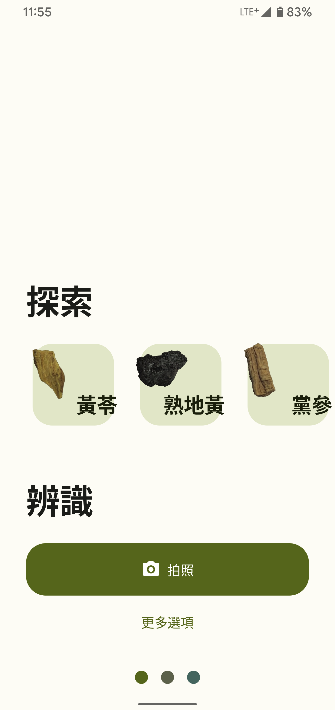
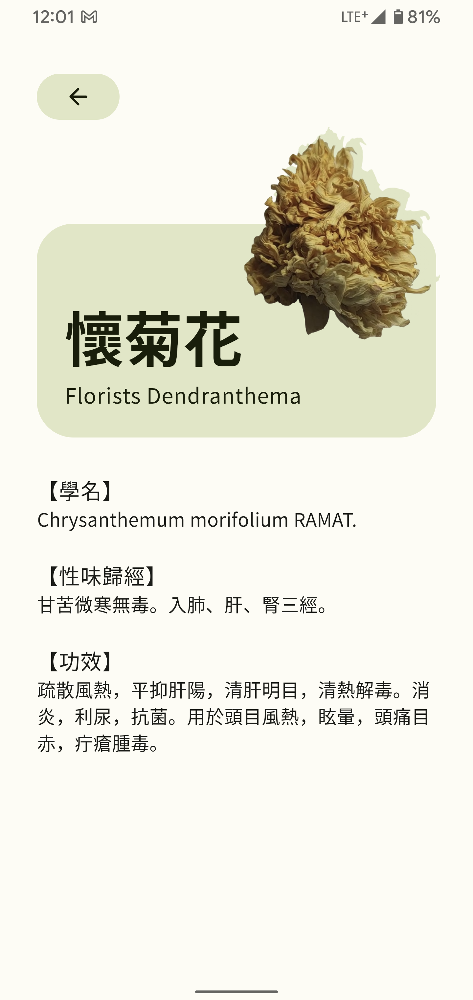
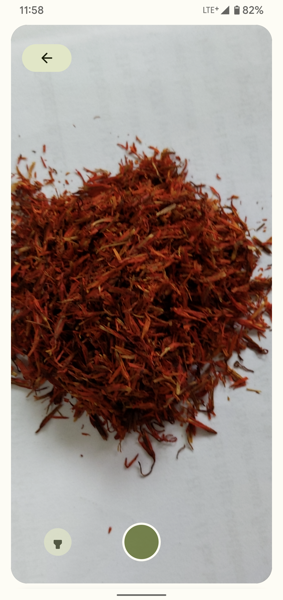
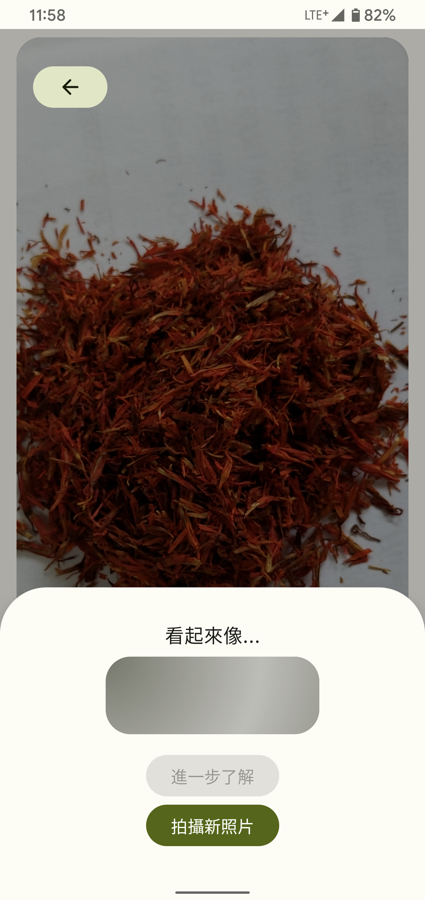
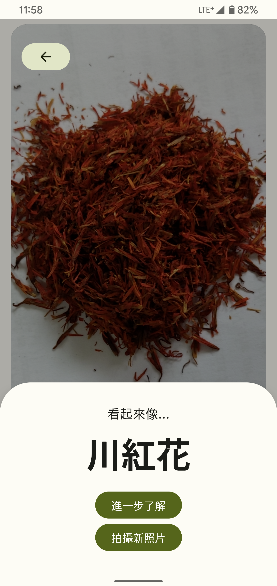

# TCM_Herb_Android

This is for the traditional chinese medicine course.

This app is for identifying different type of chinese medicine.

To run the app, simply download it and build it with android studio.

## !!! Important !!!

In order to make this app really work, please also set up the [server](https://github.com/nrchan/TCM_Herb_Server).
You can follow the readme there and set up the server.

When you're done, remember to change the url in ```ServerAgent.kt``` to yours.
(it's somewhere in this code, you can find it easily in android studio when you set Project's hierarchy view to "Android")

```kotlin
//In ServerAgent.kt
private val helloWorldURL = URL(/*your url here*/)
private val testURL = URL(/*your url here*/ + "test")
```

## Screenshots

#### Home view and detail view

Home page | Detail page
:-:|:-:
 |  

#### Identifying steps in Camera view

Take a photo | Identify | Get result
:-:|:-:|:-:
 |  | 
